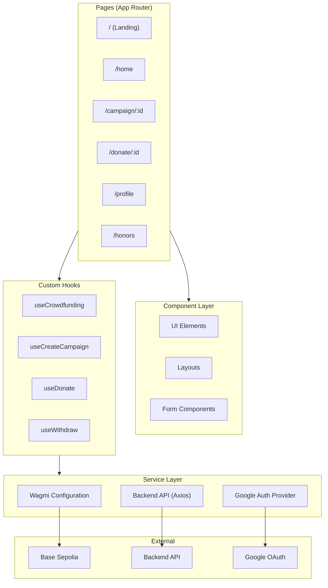

# CrowdFUNding - Frontend Application

<p align="center">
  
  
  
  
  
</p>

## Table of Contents

- [Overview](#overview)
- [Architecture](#architecture)
- [Tech Stack](#tech-stack)
- [Getting Started](#getting-started)
- [Environment Setup](#environment-setup)
- [Project Structure](#project-structure)
- [Authentication & Wallet](#authentication--wallet)
- [Key Hooks](#key-hooks)
- [Building & Deployment](#building--deployment)
- [Troubleshooting](#troubleshooting)
- [Contributing](#contributing)
- [License](#license)

---

## Overview

The **CrowdFUNding Frontend** is a modern, high-performance web application built with **Next.js 16** and **React 19**. It serves as the user interface for the CrowdFUNding platform, enabling seamless interaction with the Base blockchain for donations, campaign management, and achievement tracking.

### Key Features

- **Server-Side Rendering**: Built with Next.js App Router for optimal performance and SEO
- **Google Authentication**: Seamless social login integration for easy user onboarding
- **Multi-Wallet Support**: Integrated with RainbowKit and OnchainKit for flexible login options
- **Beautiful UI**: Styled with TailwindCSS 4 and animated with Framer Motion
- **Direct Blockchain Interaction**: Type-safe contract interactions using Wagmi and Viem

---

## Architecture

The frontend follows a modular architecture with clear separation of concerns, ensuring scalability and maintainability.



### Component Architecture

We adhere to the Atomic Design principle (modified) for maximum component reusability:

```mermaid
flowchart LR
    subgraph Atoms["Atoms"]
        Button["Button"]
        Input["Input"]
        Badge["Badge"]
    end

    subgraph Molecules["Molecules"]
        Card["CampaignCard"]
        Form["DonationForm"]
        Progress["ProgressBar"]
    end

    subgraph Organisms["Organisms"]
        Header["Header"]
        CampaignList["CampaignList"]
        DonationModal["DonationModal"]
    end

    subgraph Templates["Templates/Pages"]
        HomePage["Home Page"]
        CampaignPage["Campaign Page"]
        DonatePage["Donate Page"]
    end

    Atoms --> Molecules --> Organisms --> Templates
```



---

## Tech Stack

| Category | Technology | Description |
|----------|------------|-------------|
| **Framework** | Next.js 16 | App Router, Server Components |
| **Language** | TypeScript | Static typing for reliability |
| **UI Library** | React 19 | Latest React features |
| **Styling** | TailwindCSS 4 | Utility-first CSS framework |
| **Animations** | Framer Motion | Fluid UI transitions |
| **Blockchain** | Wagmi / Viem | Type-safe Ethereum interactions |
| **Authentication** | Google OAuth | Secure social login |
| **Wallet** | RainbowKit | Web3 wallet connection |
| **State** | TanStack Query | Server state management |
| **Farcaster** | MiniApp SDK | Native Farcaster integration (Frames v2) |

---

## Farcaster Integration (Base App)

This application is fully optimized as a **Farcaster Mini-App (Frames v2)**, allowing users to interact with the platform directly within Farcaster clients like Warpcast. 

### Features
- **Native Experience**: Runs seamlessly inside Farcaster as a full-screen mini-app.
- **Direct Context**: Accesses user context and wallet connection directly from the Farcaster client.
- **Social Graph**: Leverages the Farcaster social graph for enhanced community features.

---

## Getting Started

### Prerequisites

Ensure you have the following installed:

- **Node.js**: v18 or higher
- **Package Manager**: npm, yarn, or pnpm (pnpm recommended)

### Installation

1. **Clone the repository** (if you haven't already):
   ```bash
   git clone https://github.com/CrowdFUNding-Base/FE.git
   cd FE
   ```

2. **Install dependencies**:
   ```bash
   pnpm install
   # or
   npm install
   ```

3. **Start the development server**:
   ```bash
   pnpm dev
   # or
   npm run dev
   ```

The application will be available at `http://localhost:3000`.

---

## Environment Setup

Create a `.env.local` file in the root of the `FE` directory. This file is required for the application to function correctly.

```env
# ============================
# Authentication & Wallet
# ============================
NEXT_PUBLIC_GOOGLE_CLIENT_ID=your_google_client_id
NEXT_PUBLIC_WALLET_CONNECT_ID=your_walletconnect_project_id
NEXT_PUBLIC_ONCHAINKIT_API_KEY=your_onchainkit_api_key

# ============================
# Blockchain (RPC)
# ============================
NEXT_PUBLIC_ALCHEMY_KEY=your_alchemy_api_key

# ============================
# Smart Contract Addresses
# ============================
NEXT_PUBLIC_CAMPAIGN_ADDRESS=0x17fb0DD846d2299F525ca0d0402C607C580e80c8
NEXT_PUBLIC_BADGE_ADDRESS=0x8bdfD4C3f8e108687ABA5d9ebD9aFFe355545471
NEXT_PUBLIC_MOCK_SWAP_ADDRESS=0xd3D4F196434E8EDCc897F47b36E1234BB514f5BA
NEXT_PUBLIC_IDRX_ADDRESS=0x46d84937891D4618f2D70Db4794DFe9cFb628E46
NEXT_PUBLIC_USDC_ADDRESS=0x2D34d56F3E1f64FFa297f88E7828Ec0EC7d825f6

# ============================
# Backend API
# ============================
NEXT_PUBLIC_API_URL=http://localhost:3300
```

### How to Obtain Keys

| Variable | How to Obtain |
|----------|---------------|
| `NEXT_PUBLIC_GOOGLE_CLIENT_ID` | [Google Cloud Console](https://console.cloud.google.com/) → OAuth 2.0 Client ID |
| `NEXT_PUBLIC_WALLET_CONNECT_ID` | [WalletConnect Cloud](https://cloud.walletconnect.com) → Create Project |
| `NEXT_PUBLIC_ONCHAINKIT_API_KEY` | [Coinbase CDP](https://portal.cdp.coinbase.com) → Create API Key |
| `NEXT_PUBLIC_ALCHEMY_KEY` | [Alchemy Dashboard](https://alchemy.com) → Create Base Sepolia App |

---

## Project Structure

```
├── app/                          # Next.js App Router
├── app/(auth)/                   # Authentication route group
├── app/(main)/                   # Main layout (with navigation)
├── app/(main-no-nav)/            # Layout without navigation (e.g., Donate)
├── src/
│   ├── components/               # Reusable UI components
│   │   ├── Element/              # Atoms (Buttons, Inputs)
│   │   ├── Layout/               # Organisms (Header, Footer)
│   │   └── Contexts/             # React Contexts
│   ├── hooks/                    # Custom React hooks
│   ├── modules/                  # Page-specific business logic
│   ├── utils/
│   │   ├── abi/                  # Smart Contract ABIs
│   │   ├── api/                  # API Clients
│   │   └── wagmi/                # Blockchain Config
│   └── styles/                   # Global CSS
├── public/                       # Static assets
└── tailwind.config.ts            # Tailwind configuration
```

---

## Authentication & Wallet

We use a dual approach to handle user identity and payments:

1.  **Google Authentication**: Used for primary user identification and onboarding. This lowers the barrier to entry for non-crypto natives.
2.  **Web3 Wallets**:
    *   **RainbowKit**: Connects external wallets (MetaMask, Coinbase Wallet) for transactions.
    *   **OnchainKit**: Provides deep integration with Coinbase ecosystem features.

---

## Key Hooks

The application uses custom hooks to abstract complex blockchain logic.

### `useCrowdfunding`
Fetches campaign data, combining blockchain state with backend metadata.
```tsx
const { campaigns, isLoading } = useCrowdfunding();
```

### `useDonate`
Handles the donation flow, including the **Auto-Swap** feature (BASE/USDC -> IDRX).
```tsx
const { donate, donateWithToken } = useDonate();
// Donate 0.1 BASE
donate(campaignId, parseEther("0.1"));
```

### `useCreateCampaign`
Manages the campaign creation transaction and form submission.
```tsx
const { createCampaign } = useCreateCampaign();
```

---

## Building & Deployment

### Production Build

To create an optimized production build:

```bash
yarn build
# or
npm run build
```

Then start the production server:

```bash
yarn start
# or
npm start
```

### Deploy to Vercel

1. Push your code to GitHub.
2. Import the project into [Vercel](https://vercel.com).
3. configure the **Environment Variables** in the Vercel dashboard.
4. Click **Deploy**!

---

## Troubleshooting

| Issue | Solution |
|-------|----------|
| **Google Auth Failed** | Verify `NEXT_PUBLIC_GOOGLE_CLIENT_ID` and ensure authorized origins are set in Google Cloud Console. |
| **WalletConnect Error** | Verify `NEXT_PUBLIC_WALLET_CONNECT_ID` in `.env.local`. |
| **Contract Interactions Fail** | Ensure you are on **Base Sepolia** (Chain ID: 84532) and have sufficient ETH for gas. |
| **API Errors** | Verify your backend is running and `NEXT_PUBLIC_API_URL` is correct. |

---

## Contributing

Contributions are welcome!

1. Fork the repository
2. Create your feature branch (`git checkout -b feature/AmazingFeature`)
3. Commit your changes (`git commit -m 'Add some AmazingFeature'`)
4. Push to the branch (`git push origin feature/AmazingFeature`)
5. Open a Pull Request

---

## License

This project is licensed under the MIT License - see the LICENSE file for details.

---

<p align="center">
  Made with ❤️ by UGM BCC
</p>
